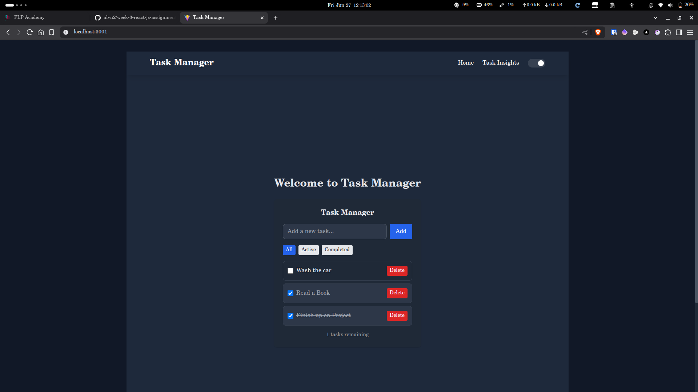

## Task Manager

A responsive task management app built using React, Tailwind CSS, and Vite. It supports adding, filtering, and deleting tasks with localStorage persistence.

##  Features
- Add / complete / delete tasks
- Filter tasks (All, Active, Completed)
- Light/Dark mode ready
- Responsive design (Mobile/Desktop)
- Built with reusable components


## Tech Stack
- React.js
- Tailwind CSS
- Vite
- React Hooks
- LocalStorage

##  Project Structure
```
src/
├── components/      
├── pages/            
├── hooks/            
├── api/              
├── App.jsx           
├── main.jsx          
├── index.css         
```

##  Getting Started
```bash
git clone <your-github-repo-url>
cd my-task-app
npm install
npm run dev
```

## 🔗 Live Demo
[Live Demo](https://taskmanager-ten-pink.vercel.app/)

## 🖼️ Screenshots



## 📄 License
MIT
